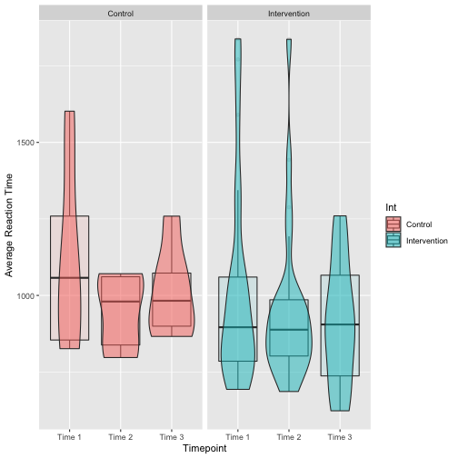

Measuring Cognitive Change Over the Course of an 8-Week Mindfulness-Based Mobile Intervention
========================================================
<h2> Faculty contact: Becky Silton (Clinical Psychology) </h2>

<h3> Qing Gong, Bao Van, and Nathan Lutz </h3>

<h3> 10/18/2021 </h3>

Mindfulness
========================================================
<h2> Headspace </h2>

- Mindfulness and Meditation App

- Developed in 2010

- Over 65 million downloads as of May 2021

***


Mindfulness and Depression
========================================================
<ul>
<li> Research has shown the effectiveness of mindfulness-based interventions on depression
    <h5>
    <ul>
    <li> Mindfulness-based cognitive therapy (Tovote et al., 2014)
    <li> Combination with medication (Huijbers et al., 2015)
    <li> Meta-analysis (Hofmann et al., 2010)
</li>
</ul>
</h5>
***


Depression and Cognition
========================================================
<ul>
<li> Cognition is a reliable predictor of depression
    <ul>
    <li> Phillips et al., 2010
    </li>
    </ul>
</li>
</ul>

<ul>
<li> Researchers in Dr. Silton's WELL Lab were unable to collect data during COVID-19
    <ul>
    <li> Decided to contract with NeuroUX
    <li> Wanted to test effectiveness of Headspace usage on cognition
    <li> Participants played five games testing cognition across three time points
</li>
</ul>

Depression and Cognition
========================================================

- Participants played five games at each time point
<h5>
 1. Color Trick 1
 2. Color Trick 2
 3. Color Trick 3
 4. Hand Swype
 5. Quick Tap
</h5>

***


Data Cleaning
========================================================

- 6 separate datasets
- Duplicate case at one timepoint

<font size = "2">

```r
R5<- R5%>%
  filter(level_start_timestamp != "2021-03-25T18:55:58.767Z")
```
</font>

- Duplicate usernames

***

<font size = "2">

```r
R1<-mutate(R1, semester=1, timepoint=1, ID = as.factor(as.numeric(gsub("user", "", userid))+100))
R2<-mutate(R2, semester=1, timepoint=2, ID = as.factor(as.numeric(gsub("user", "", userid))+100))
R3<-mutate(R3, semester=1, timepoint=3, ID = as.factor(as.numeric(gsub("user", "", userid))+100))
R4<-mutate(R4, semester=2, timepoint=1, ID = as.factor(as.numeric(gsub("user", "", userid))+200))
R5<-mutate(R5, semester=2, timepoint=2, ID = as.factor(as.numeric(gsub("user", "", userid))+200))
R6<-mutate(R6, semester=2, timepoint=3, ID = as.factor(as.numeric(gsub("user", "", userid))+200))
```
</font>

- "Test" user

<font size = "2">

```r
Full<-rbind(R1, R2, R3, R4, R5, R6)
Full <- Full%>%
          filter(ID != 140)
```
</font>

Full Dataset
========================================================
<font size = "2">

```r
str(Full)
```

```
'data.frame':	7343 obs. of  49 variables:
 $ game_name                   : chr  "color trick 1" "color trick 1" "color trick 1" "color trick 1" ...
 $ userid                      : chr  "user1" "user1" "user1" "user1" ...
 $ sessionid                   : chr  "631d4ef0-32a3-4145-8847-d9995b9bf6a3" "631d4ef0-32a3-4145-8847-d9995b9bf6a3" "631d4ef0-32a3-4145-8847-d9995b9bf6a3" "631d4ef0-32a3-4145-8847-d9995b9bf6a3" ...
 $ event_type                  : chr  "trial" "trial" "trial" "trial" ...
 $ is_response_correct         : logi  TRUE TRUE TRUE TRUE TRUE NA ...
 $ trial_timestamp             : chr  "2020-10-08T18:44:32.349Z" "2020-10-08T18:44:33.916Z" "2020-10-08T18:44:35.450Z" "2020-10-08T18:44:29.616Z" ...
 $ trial_number                : int  7 8 9 5 6 NA 1 2 3 4 ...
 $ user_response               : chr  "[\"blue\"]" "[\"black\"]" "[\"orange\"]" "[\"red\"]" ...
 $ correct_response            : chr  "[\"blue\"]" "[\"black\"]" "[\"orange\"]" "[\"red\"]" ...
 $ response_reaction_time      : num  844 827 577 711 586 ...
 $ response_timestamp          : chr  "2020-10-08T18:44:33.192Z" "2020-10-08T18:44:34.742Z" "2020-10-08T18:44:36.026Z" "2020-10-08T18:44:30.326Z" ...
 $ correct_count               : int  7 8 9 5 6 9 1 2 3 4 ...
 $ incorrect_count             : int  0 0 0 0 0 0 0 0 0 0 ...
 $ mechanic_name               : chr  "meaning to meaning" "meaning to meaning" "meaning to meaning" "meaning to meaning" ...
 $ total_help_time             : num  0 0 0 0 0 NA 0 0 0 0 ...
 $ attempted                   : logi  NA NA NA NA NA NA ...
 $ response_timeout            : logi  NA NA NA NA NA NA ...
 $ score                       : int  7 8 9 5 6 NA 1 2 3 4 ...
 $ trial_timeout_duration      : num  NA NA NA NA NA NA NA NA NA NA ...
 $ total_trials                : int  9 9 9 9 9 9 9 9 9 9 ...
 $ character_revealed          : logi  NA NA NA NA NA NA ...
 $ level_character_distractor  : chr  "" "" "" "" ...
 $ level_character_target      : chr  "" "" "" "" ...
 $ level_distractor_probability: num  NA NA NA NA NA NA NA NA NA NA ...
 $ level_max_interval          : num  NA NA NA NA NA NA NA NA NA NA ...
 $ level_min_interval          : num  NA NA NA NA NA NA NA NA NA NA ...
 $ stimuli_delay_time          : num  NA NA NA NA NA NA NA NA NA NA ...
 $ stimuli_type                : chr  "" "" "" "" ...
 $ fastest_reaction_time       : num  NA NA NA NA NA NA NA NA NA NA ...
 $ median_reaction_time        : num  NA NA NA NA NA NA NA NA NA NA ...
 $ time_left                   : num  NA NA NA NA NA NA NA NA NA NA ...
 $ time_up                     : logi  NA NA NA NA NA NA ...
 $ timer_duration              : num  NA NA NA NA NA NA NA NA NA NA ...
 $ hand_color                  : chr  "" "" "" "" ...
 $ moving_direction            : chr  "" "" "" "" ...
 $ pointing_direction          : chr  "" "" "" "" ...
 $ average_reaction_time       : num  NA NA NA NA NA 896 NA NA NA NA ...
 $ options                     : chr  "[{\"color\":\"brown\",\"isanswer\":false,\"text\":\"green\"},{\"color\":\"orange\",\"isanswer\":true,\"text\":\"| __truncated__ "[{\"color\":\"orange\",\"isanswer\":false,\"text\":\"green\"},{\"color\":\"blue\",\"isanswer\":true,\"text\":\""| __truncated__ "[{\"color\":\"brown\",\"isanswer\":true,\"text\":\"orange\"},{\"color\":\"blue\",\"isanswer\":false,\"text\":\""| __truncated__ "[{\"color\":\"blue\",\"isanswer\":false,\"text\":\"yellow\"},{\"color\":\"green\",\"isanswer\":true,\"text\":\""| __truncated__ ...
 $ question                    : chr  "[{\"color\":\"pink\",\"text\":\"blue\"}]" "[{\"color\":\"pink\",\"text\":\"black\"}]" "[{\"color\":\"green\",\"text\":\"orange\"}]" "[{\"color\":\"blue\",\"text\":\"red\"}]" ...
 $ question_prompt             : chr  "select the option which has the same meaning as the word in the top box." "select the option which has the same meaning as the word in the top box." "select the option which has the same meaning as the word in the top box." "select the option which has the same meaning as the word in the top box." ...
 $ level_start_timestamp       : chr  "2020-10-08T18:44:08.297Z" "2020-10-08T18:44:08.297Z" "2020-10-08T18:44:08.297Z" "2020-10-08T18:44:08.297Z" ...
 $ level_end_timestamp         : chr  "" "" "" "" ...
 $ level_total_time            : int  NA NA NA NA NA 29958 NA NA NA NA ...
 $ session_complete            : logi  NA NA NA NA NA NA ...
 $ session_start_timestamp     : chr  "" "" "" "" ...
 $ session_end_timestamp       : chr  "" "" "" "" ...
 $ semester                    : num  1 1 1 1 1 1 1 1 1 1 ...
 $ timepoint                   : num  1 1 1 1 1 1 1 1 1 1 ...
 $ ID                          : Factor w/ 34 levels "101","102","103",..: 1 1 1 1 1 1 1 1 1 1 ...
```
</font>

Scorecard
========================================================


<font size = "4">

```r
Scores<-filter(Full, event_type == "scorecard")
Scores2<-select(Scores, c(ID, Int, semester, timepoint, tp_fac,
                          game_name, correct_count, incorrect_count,
                          total_trials, fastest_reaction_time, median_reaction_time,
                          average_reaction_time, level_total_time
                          ))

str(Scores2)
```

```
'data.frame':	436 obs. of  13 variables:
 $ ID                   : Factor w/ 34 levels "101","102","103",..: 1 1 1 1 1 10 10 10 10 10 ...
 $ Int                  : Factor w/ 2 levels "Control","Intervention": 2 2 2 2 2 2 2 2 2 2 ...
 $ semester             : num  1 1 1 1 1 1 1 1 1 1 ...
 $ timepoint            : num  1 1 1 1 1 1 1 1 1 1 ...
 $ tp_fac               : Ord.factor w/ 3 levels "Time 1"<"Time 2"<..: 1 1 1 1 1 1 1 1 1 1 ...
 $ game_name            : chr  "color trick 1" "color trick 2" "color trick 3" "hand swype" ...
 $ correct_count        : int  9 9 9 30 NA 9 8 8 23 NA ...
 $ incorrect_count      : int  0 0 0 4 2 0 1 1 11 1 ...
 $ total_trials         : int  9 9 9 35 15 9 9 9 35 15 ...
 $ fastest_reaction_time: num  NA NA NA NA 364 NA NA NA NA 453 ...
 $ median_reaction_time : num  NA NA NA NA 472 NA NA NA NA 499 ...
 $ average_reaction_time: num  896 979 1056 1768 NA ...
 $ level_total_time     : int  29958 28793 31825 84452 79230 38652 34373 41377 104072 96419 ...
```
</font>

Color Trick 1 Proportion Correct
========================================================
<font size = "2">

```r
ColorTrick1<-filter(Scores2, game_name == "color trick 1")
library(lattice)
ColorTrick1C <- filter(ColorTrick1, Int == "Control")
xyplot(prop_cor ~ timepoint | ID, data = ColorTrick1C, as.table = T,
       xlab = "Timepoint", ylab = "Proportion Correct", grid = T, pch = 19,
       type = c("p", "r"), col.line = "darkblue", lwd = 3, lty = 4 )
```


</font>

***
<font size = "2">

```r
ColorTrick1I <- filter(ColorTrick1, Int == "Intervention")

xyplot(prop_cor ~ timepoint | ID, data = ColorTrick1I, as.table = T,
       xlab = "Timepoint", ylab = "Proportion Correct", grid = T, pch = 19,
       type = c("p", "r"), col.line = "darkblue", lwd = 3, lty = 4 )
```


</font>

Color Trick 1 Reaction Time
========================================================
<font size = "2">

```r
ColorTrick1<-filter(Scores2, game_name == "color trick 1")
library(lattice)
ColorTrick1C <- filter(ColorTrick1, Int == "Control")
xyplot(average_reaction_time ~ timepoint | ID, data = ColorTrick1C, as.table = T,
       xlab = "Timepoint", ylab = "Reaction Time", grid = T, pch = 19,
       type = c("p", "r"), col.line = "darkblue", lwd = 3, lty = 4 )
```


</font>

***
<font size = "2">

```r
ColorTrick1I <- filter(ColorTrick1, Int == "Intervention")

xyplot(average_reaction_time ~ timepoint | ID, data = ColorTrick1I, as.table = T,
       xlab = "Timepoint", ylab = "Reaction Time", grid = T, pch = 19,
       type = c("p", "r"), col.line = "darkblue", lwd = 3, lty = 4 )
```


</font>

Color Trick 1 Reaction Time
========================================================
<font size = "2">

```r
ColorTrick1%>%
  ggplot(aes(x = tp_fac, y = average_reaction_time, fill = Int))+
  geom_boxplot(alpha = .1)+
  geom_violin(alpha = .5)+
  xlab("Timepoint")+
  ylab("Level Total Time")+
  facet_wrap(.~Int)
```


</font>  

Future Directions
========================================================
- Determine best route for measuring depression

- Which game is best?

- Which outcome is best?

- Determining analytic method

References
========================================================
<font size = "4">
Hofmann, S. G., Sawyer, A. T., Witt, A. A., & Oh, D. (2010). The Effect of Mindfulness-Based Therapy on Anxiety and Depression: A Meta-Analytic Review. Journal of Consulting and Clinical Psychology, 78(2), 169–183. https://doi.org/10.1037/a0018555

Huijbers, M. J., Spinhoven, P., Spijker, J., Ruhe, H. G., van Schaik, D. J. F., van Oppen, P., Nolen, W. A., Ormel, J., Kuyken, W., van der Wilt, G. J., Blom, M. B. J., Schene, A. H., Donders, A. R. T., & Speckens, A. E. M. (2015). Adding mindfulness-based cognitive therapy to maintenance antidepressant medication for prevention of relapse/recurrence in major depressive disorder: Randomised controlled trial. Journal of Affective Disorders, 187, 54–61.

Phillips, W. J., Hine, D. W., & Thorsteinsson, E. B. (2010). Implicit cognition and depression: A meta-analysis. Clinical Psychology Review, 30(6), 691–709. https://doi.org/10.1016/j.cpr.2010.05.002

Tovote, K. A., Fleer, J., Snippe, E., Peeters, A. C. T. M., Emmelkamp, P. M. G., Sanderman, R., Links, T. P., & Schroevers, M. J. (2014). Individual Mindfulness-Based Cognitive Therapy and Cognitive Behavior Therapy for Treating Depressive Symptoms in Patients With Diabetes: Results of a Randomized Controlled Trial. Diabetes Care, 37(9), 2427–2434. https://doi.org/10.2337/dc13-2918
</font>
